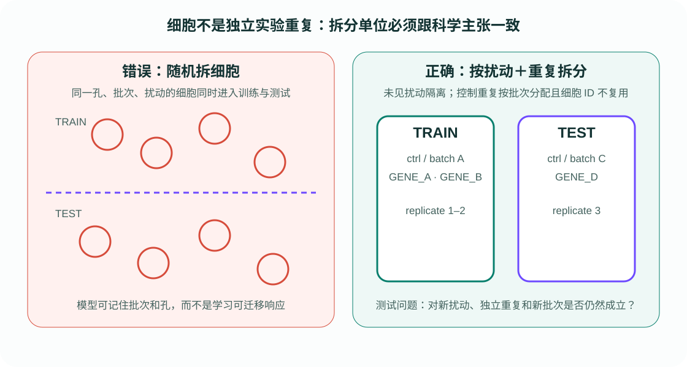

# 实验单位、重复与设计

单细胞实验可以产生几十万行数据，但真正独立的实验单位可能只有几个供体、培养皿或处理批次。AIVC 项目最常见的统计错误，就是把每个细胞当作一个独立重复，得到极小的 \(p\) 值和过度乐观的测试集成绩。

{ .figure-wide }

## 先画出实验层级

一个典型 Perturb-seq 实验至少包含以下层级：

```text
研究对象/供体
└── 生物重复
    └── 批次或培养板
        └── 孔/处理条件
            └── 捕获到的细胞
```

同一孔中的细胞共享培养环境、试剂、处理时间、测序深度和很多未记录因素。它们可以帮助估计一个孔内的细胞异质性，却不能替代新的孔或新的生物重复。

## 三类重复

| 重复 | 改变什么 | 能支持的主张 |
|---|---|---|
| 技术重复 | 建库、测序或成像过程 | 测量流程是否稳定 |
| 生物重复 | 独立样本、培养或供体 | 生物效应是否可重复 |
| 观测单元 | 同一重复内的细胞 | 该重复内部的状态分布 |

如果论文只在一个细胞系的一次实验上拆分细胞，它最多证明模型能够在该实验分布内重建或插值，不能证明跨实验泛化。

## 设计顺序

1. 写出主要比较，例如“同一细胞背景中 CRISPRi 相对非靶向控制的响应”。
2. 确定随机化单位。能在孔层面随机分配处理，就不要只在计算阶段补救。
3. 为板位、测序批次、供体和处理时间建立显式元数据。
4. 在采集数据前定义排除规则、主要终点和测试拆分。
5. 保留阴性控制、阳性控制和过程控制，分别检查漂移、效应检测能力和操作失败。

## 对机器学习拆分的影响

- 评测新扰动：按扰动目标留出，不能随机拆细胞。
- 评测新供体：整个供体进入测试集。
- 评测跨批次：测试批次不能与训练共享细胞或重复。
- 控制细胞：可以让每个集合都有控制，但必须来自不同重复或批次，不能复制同一批控制细胞。

!!! warning "样本量不是细胞数"
    增加同一孔中的细胞主要降低该孔均值的测量误差；增加独立重复才能更可靠地估计处理在新实验中的变异。

## 一手来源

- [Nature Methods：单细胞差异表达中的伪重复](https://doi.org/10.1038/s41467-021-21038-1)
- [sc-best-practices：实验设计与批次](https://www.sc-best-practices.org/conditions/experimental_design.html)
- [Arc Virtual Cell Challenge：按扰动划分的真实评测](https://github.com/ArcInstitute/arc-virtual-cell-atlas/tree/main/virtual-cell-challenge)
