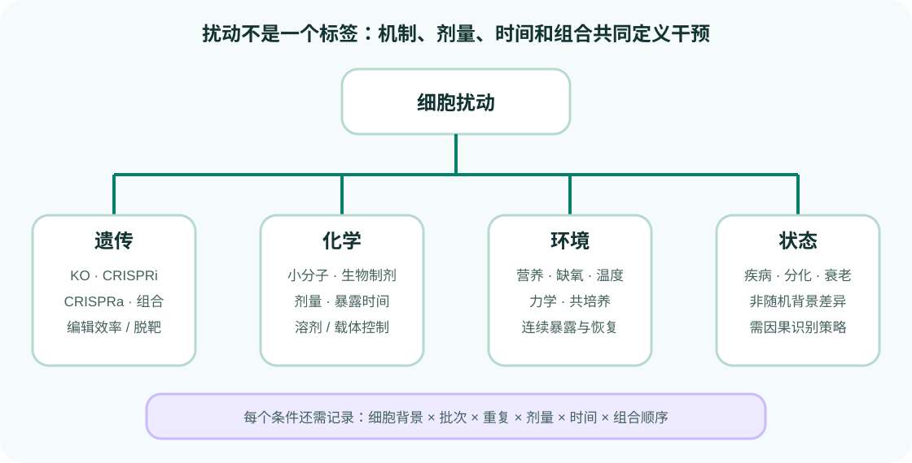

# 遗传、化学与环境扰动设计

{ .figure-wide }

模型常把条件压缩成一个字符串，但实验中的“扰动”至少由目标、作用方式、强度、持续时间、组合顺序和细胞背景共同定义。

## 遗传扰动

- CRISPR knockout 改变 DNA，可能触发移码、补偿或强选择。
- CRISPRi 抑制转录，效果通常是连续而非二元。
- CRISPRa 激活表达，受启动子可及性和细胞背景影响。
- 多基因组合需要区分相加、协同和拮抗，并考虑多个 guide 的捕获概率。

除扰动标签外，应记录 guide 序列、靶位点、MOI、guide 数量、编辑或抑制效率，以及非靶向和阳性控制。

## 化学扰动

化合物名称不能代替实验条件。至少记录浓度、溶剂、暴露时间、给药顺序、批号和细胞活性。剂量响应可能非单调；高剂量的共同毒性程序容易让模型获得看似很高的相关性。

## 环境与状态变化

缺氧、营养、力学刺激、共培养和疾病背景通常没有单一“靶基因”。状态差异还可能包含供体、组织和处理历史的混杂。此类数据更适合明确描述为条件转移，不能默认等价于随机干预。

## 控制组

不同干预需要不同控制：

| 干预 | 关键控制 |
|---|---|
| CRISPR | 非靶向 guide、无 guide、编辑系统本身 |
| 药物 | 匹配浓度溶剂、时间匹配、阳性效应控制 |
| 刺激 | 未刺激、操作过程控制 |
| 疾病状态 | 匹配供体/组织，必要时加入同基因背景对照 |

## 建模前的条件表

为每个条件建立结构化表，而不是从名称字符串猜测：

```text
condition_id, target, mechanism, dose, duration,
cell_type, batch, replicate, control_id
```

组合条件另加成分列表和施加顺序。模型可以使用这些字段，但评测时必须避免同一组合成分通过命名或重复样本泄漏。

## 一手来源

- [Norman 组合 CRISPRa Perturb-seq](https://doi.org/10.1126/science.aax4438)
- [Replogle 全基因组 Perturb-seq](https://doi.org/10.1016/j.cell.2022.05.013)
- [sci-Plex 化学扰动](https://doi.org/10.1126/science.aax6234)
