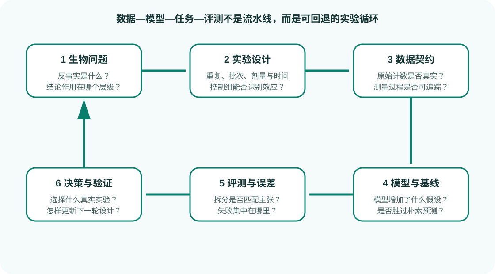

# 虚拟实验、假设生成与主动学习

虚拟实验不是生成一张漂亮的表达热图，而是让模型比较可执行的干预方案、量化不确定性，并选择最有价值的真实实验。

{ .figure-wide }

## 一个完整循环

1. 定义决策，例如从 1,000 个候选靶点中选择 20 个实验。
2. 指定效用：效应幅度、疾病逆转、信息增益、成本和安全约束。
3. 生成候选预测与不确定性。
4. 按预算、对照和平衡设计生成实验批次。
5. 执行实验并记录失败、缺失和阴性结果。
6. 更新模型，比较新一轮的校准和命中率。

## 主动学习不只挑最不确定样本

纯不确定性采样可能集中于噪声、不可测条件或离群点。实用策略应同时考虑：

- 预期效用或信息增益；
- 候选多样性；
- 实验可行性和批次容量；
- 阳性/阴性控制；
- 对高风险预测的独立确认；
- 探索与利用之间的比例。

## 离线评测的陷阱

在历史数据上模拟主动学习时，模型只能选择已经做过的实验，缺少的结果不可观测。历史采样策略也并非随机，容易产生选择偏差。最可信证据来自前瞻闭环。

## 停止规则

在开始前定义：

- 达到多少命中率或不确定性覆盖后停止；
- 连续几轮无提升时停止；
- 最大实验预算；
- 何时需要更换读出或模型；
- 如何处理毒性、失败建库和不可复现命中。

## 输出规范

每个建议实验应包含预测、置信区间、主要依据、相似训练条件、OOD 标记、成本和验证读出。模型不得只输出一个无来源的排序。

## 一手来源

- [AIVC 愿景论文](https://doi.org/10.1016/j.cell.2024.11.015)
- [Arc Virtual Cell Initiative](https://arcinstitute.org/virtual-cell-initiative)
- [Active learning in the life sciences review](https://doi.org/10.1038/s41573-021-00227-9)
