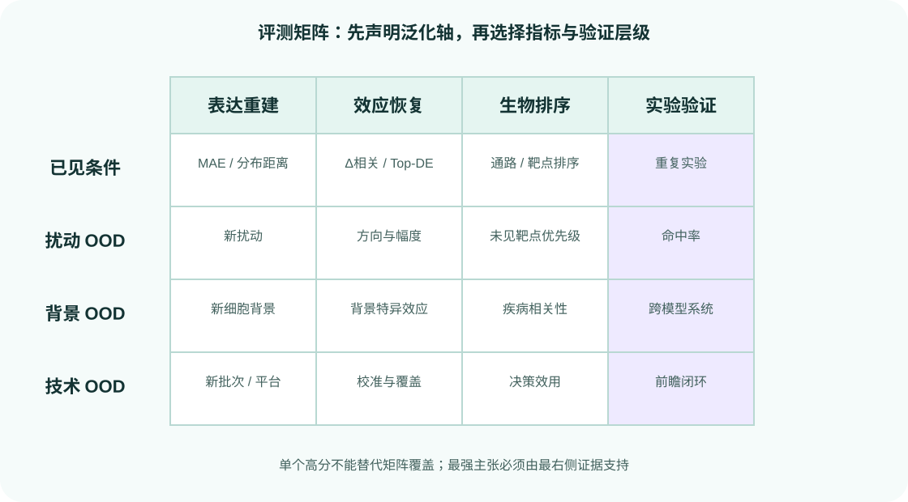

# 指标、校准与不确定性

{ .figure-wide }

没有一个指标能覆盖 AIVC 的全部主张。表达矩阵中大量未变化基因会主导全局误差，而只看差异基因又可能忽略错误的背景表达和基因选择偏差。

## 五个层级

1. **绝对表达**：MAE、MSE、相关性。
2. **扰动变化**：减去匹配控制后的相关、方向和幅度。
3. **特征集合**：Top-DE overlap、通路和模块恢复。
4. **分布**：能量距离、MMD、最优传输距离、亚群比例。
5. **决策**：靶点命中率、排序增益和实验成本。

指标必须使用与模型输出一致的单位。log 归一化表达上的 MAE 不能解释为分子计数误差。

## 分组报告

至少按效应强度、细胞类型、批次、单/组合扰动和训练相似度分组。总体平均可能掩盖模型只在强扰动或高表达基因上有效。

## 不确定性

区分：

- 数据噪声导致的 aleatoric uncertainty；
- 模型或有限训练数据导致的 epistemic uncertainty；
- 分布外输入带来的未知风险。

可使用深度集成、后验采样、共形预测或距离型 OOD 分数，但都需要独立校准集。

## 校准检查

- 预测区间在独立重复上的覆盖率；
- 置信度分箱与实际误差；
- OOD 条件是否具有更高不确定性；
- 失败和弱扰动是否被识别；
- 选择性预测：拒绝低置信样本后，剩余误差是否下降。

不确定性高不代表候选有价值，也不代表实验一定会失败；它是决策输入之一。

## Arc 指标

DES 关注差异表达集合，PDS 关注扰动特异性，MAE 关注全表达误差。三者衡量不同方面，应使用官方 `cell-eval` 实现并同时报告，不能用自定义近似值冒充官方成绩。

## 一手来源

- [Arc cell-eval](https://github.com/ArcInstitute/arc-virtual-cell-atlas/tree/main/virtual-cell-challenge)
- [scIB metrics](https://doi.org/10.1038/s41592-021-01336-8)
- [Conformal prediction overview](https://doi.org/10.1561/2200000101)
