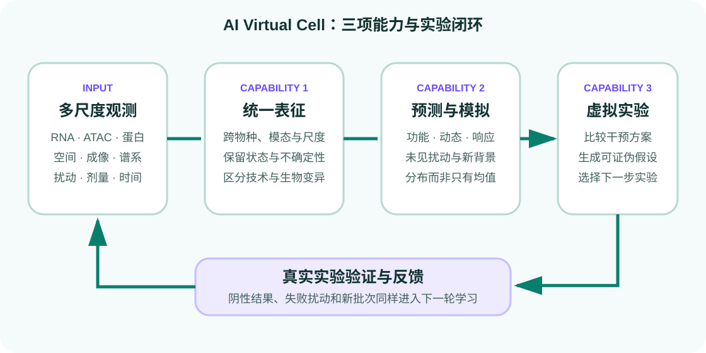

<section class="hero">
  

    
AI Virtual Cell Guide · 公开 Beta

    <h1>理解细胞，预测变化，设计可检验的虚拟实验</h1>
    
面向 AI 背景跨学科新人的中文全景知识地图。把概念、实验、数据、模型、评测和真实验证放进同一条可复现路线。

    

      <a class="md-button md-button--primary" href="00-start-here/index.html">从这里开始</a>
      <a class="md-button" href="tutorials/perturbation-response/index.html">运行首个实践</a>
    

  

  

    
  

</section>

!!! warning "科学边界"
    当前 AIVC 远未达到完整、高保真的细胞模拟。模型输出是待验证的计算假设，不是生物学真相，更不是临床建议。

## 选择你的路线

  <a class="path-card" href="learning-paths/ai-to-biology/"><strong>AI → 生物</strong>补齐实验、测量、因果和单细胞数据语义。</a>
  <a class="path-card" href="learning-paths/biology-to-ai/"><strong>生物 → AI</strong>从统计基线走到表示、生成和泛化评测。</a>
  <a class="path-card" href="learning-paths/research-frontiers/"><strong>研究前沿</strong>把兴趣转成可证伪问题、数据划分和验证计划。</a>

## 一张图看懂 AIVC

{ .figure-wide }

三项核心能力来自 2024 年 *Cell* 的
[AIVC 愿景论文](https://doi.org/10.1016/j.cell.2024.11.015)：跨物种、模态和尺度的统一表征；预测功能、动态和扰动响应；执行虚拟实验并指导真实实验。本指南进一步加入实验设计、统计基线、数据泄漏、不确定性和证据分级。

## 当前内容

  
<strong>48+ 个知识页面</strong>基础、数据、模型、任务、评测、应用与生态。

  
<strong>100 条审校资源</strong>论文、模型、数据集、基准、工具与组织。

  
<strong>双计算路线</strong>本地 CPU 基线＋Colab GPU GEARS 扩展。

## 推荐入口

- 想先建立全局概念：阅读[AIVC 的定义与边界](00-start-here/index.md)。
- 想理解模型到底看到了什么：进入[数据与实验](02-data-and-experiments/index.md)。
- 想避免排行榜陷阱：先读[评测原则](05-evaluation/index.md)。
- 想直接动手：运行[扰动响应预测实践](tutorials/perturbation-response/index.md)。
- 想查资源：使用可搜索、可筛选的[结构化目录](catalog/index.md)。

## 最新更新

`v0.2.0-beta` 完成 Schema v2、100 条目录、19 个深度专题、五张原创知识图、AnnData 契约 v2、严格拆分和真实数据复现入口。详见
[Changelog](https://github.com/methylation5mc2026-jpg/AI-Virtual-Cell-Guide/blob/main/CHANGELOG.md)。

## 编辑原则

- 核心事实优先引用论文、官方仓库和机构页面。
- 先建立统计与生物学基线，再讨论模型规模。
- 明确区分已见数据重建、未见扰动和新生物背景泛化。
- 每个目录条目记录来源、复现状态、证据阶段、计算需求、限制和核验日期。
- 不以资源数量或模型参数量代替科学质量。
